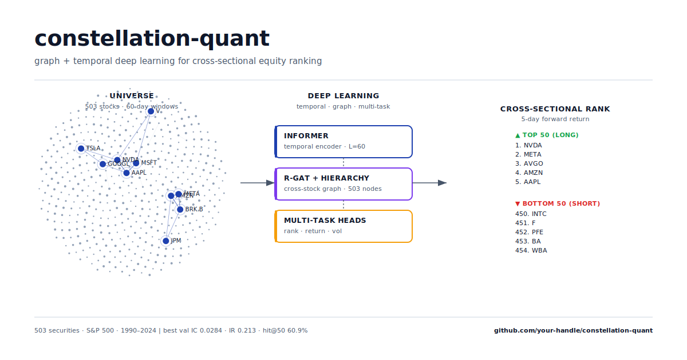
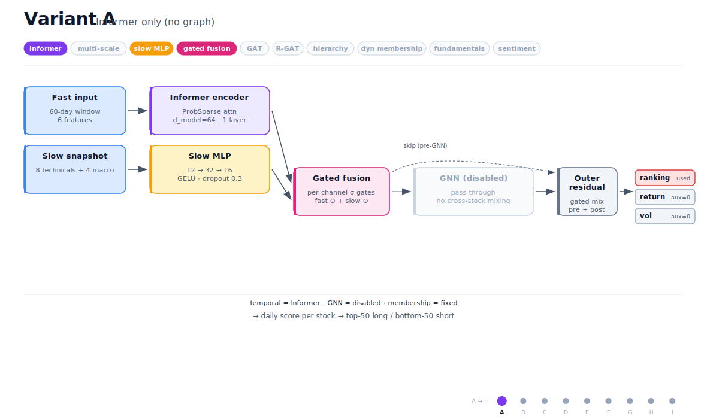
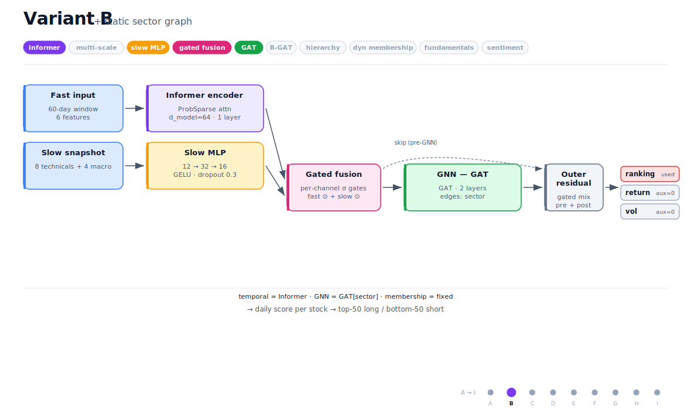
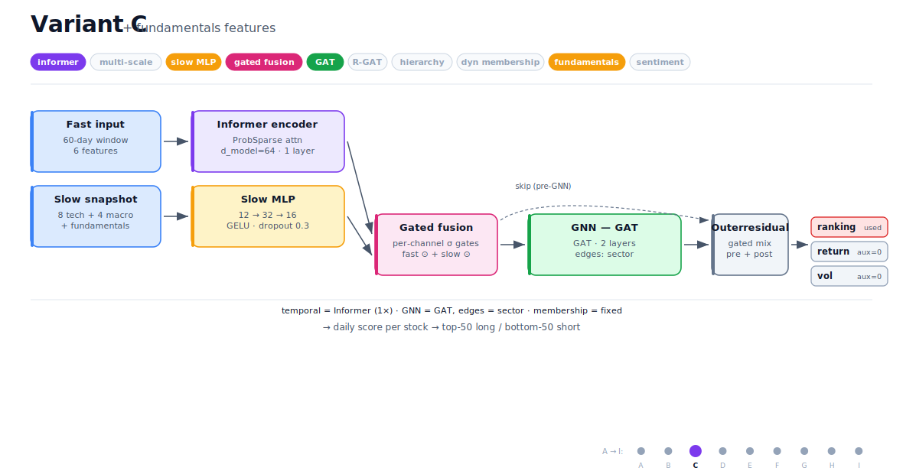
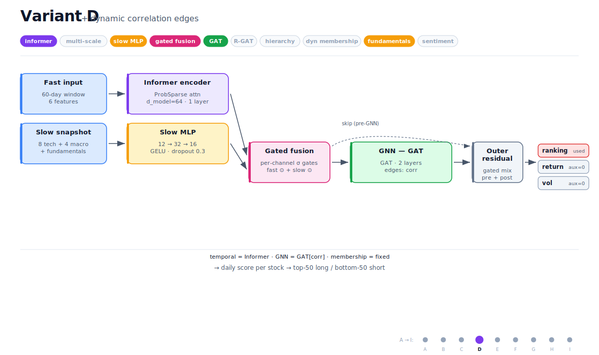
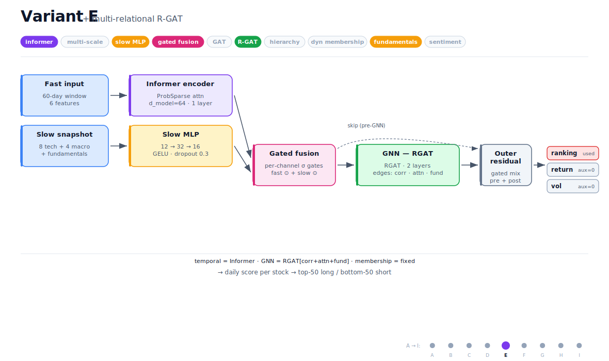
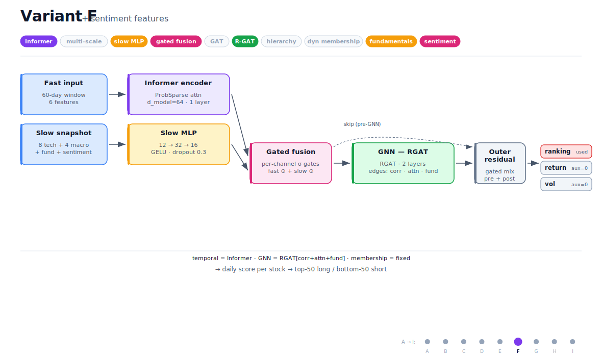
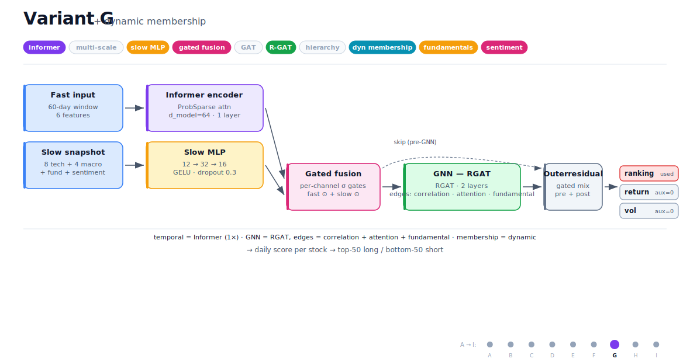
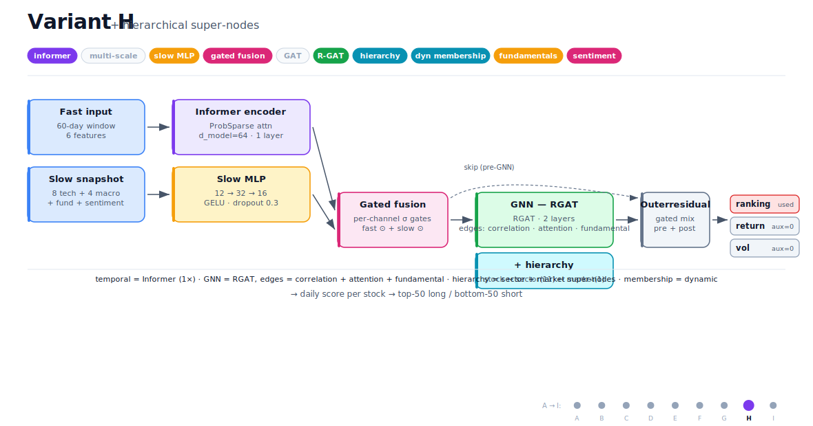
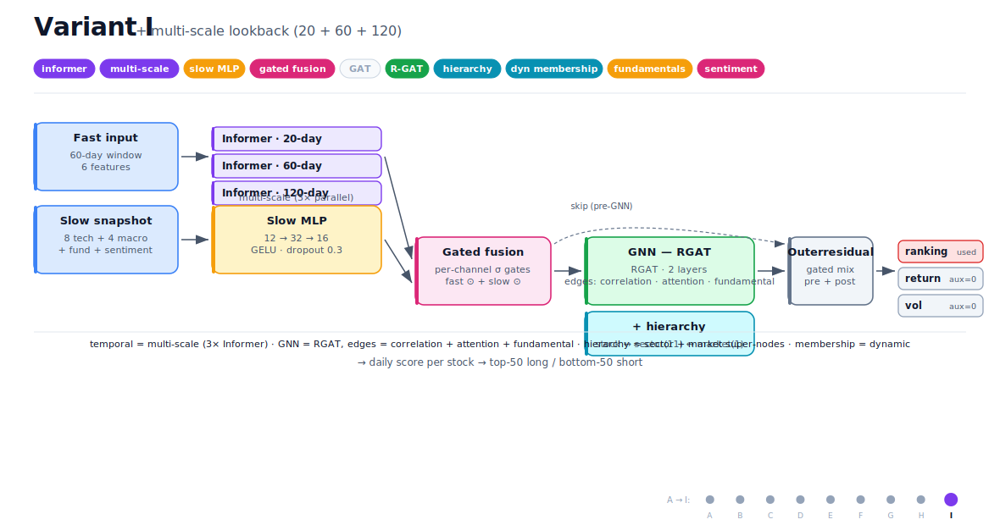

# constellation-quant



I built this to predict which S&P 500 stocks would outperform over the next
five trading days. Instead of treating each stock as independent, the whole
market is a graph: stocks are nodes, the edges are correlations and shared
fundamentals, and a neural net passes messages between them every day. The
backbone is an Informer (a Transformer designed for long sequences) and on top
of that I added sector and market "super-nodes" so information can flow
through sector-level state too. The model emits one score per stock per day,
which a backtester turns into a long/short portfolio (top 50 long, bottom 50
short, weekly rebalance).

Everything here was trained on **35 years** of S&P 500 history (1990–2024).
The universe is **time-stamped**: for any prediction date, I only show the
model the stocks that were actually in the index on that date. No survivorship
shortcuts at the universe level — though see the caveats below for the
delisted-stock blind spot.

---

## What I found

After running 9 architectural variants and a learning-rate sweep on the top 3,
the best validation Information Coefficient was **0.0284** (variant I,
multi-scale Informer + R-GAT + sector hierarchy, lr=3e-4) — competitive with
academic finance ML papers using comparable data.

The validation signal **did not transfer to the held-out 2020–2024 test
period**. Test-period IC is statistically indistinguishable from zero across
all three top variants (t-stats < 0.5). The model overfits the validation
window. See [Held-out test results](#held-out-test-results-the-honest-answer)
below for the full breakdown.

| | Val (2016–2019) | **Test (2020–2024)** |
|---|---|---|
| Best variant (I @ lr=3e-4, ep 10) | val_ic 0.0284 | **mean IC +0.0029, t-stat +0.29** |
| Variant D @ lr=3e-4 | val_ic 0.0276 | **mean IC +0.0043, t-stat +0.39** |
| Variant C @ lr=3e-4 | val_ic 0.0254 | **mean IC −0.0034, t-stat −0.31** |
| Universe | 503 securities, time-stamped S&P 500 membership | |
| Train / Val / Test | 1990–2015 / 2016–2019 / 2020–2024 | |
| Architectural variants | 9 (A through I) + 9-point LR sweep on top 3 | |
| Training runs analysed | 65 (52 Phase 1 + 13 Phase 2 chained jobs) | |
| Tests | 224 passing | |

The full per-epoch breakdown is in
[`PROJECT_REPORT.md`](PROJECT_REPORT.md), parsed CSVs live in
[`analysis/`](analysis/), and the test diagnostic output is in
[`analysis/test_ic_results.csv`](analysis/test_ic_results.csv).

---

## A caveat about the data

All of the numbers above come from **free, public yfinance data** — daily
OHLCV, scraped fundamentals, and four macro series (VIX, 10Y yield, DXY, SPY).
Across nine very different architectures, val IC plateaued somewhere in the
0.022–0.028 range. That's a fairly tight band considering how much the
architectures differ from each other, which is the giveaway: I'm hitting the
information ceiling of the data, not a model design ceiling.

The held-out test result confirms this: **the val signal does not survive an
out-of-sample regime shift**. Test IC across 2020–2024 is statistically zero
for every top variant. The 2020–2024 period (COVID, recovery, rate-hike
cycle, tech boom/bust) has different cross-sectional dynamics than the
2016–2019 val window, and yfinance technicals don't carry enough information
to bridge that.

To get materially higher than 0.028 *and* have it generalise OOS, I'd need
different data. CRSP would give me survivorship-bias-free returns and clean
delisting handling. Compustat gives clean, restated fundamentals (yfinance
fundamentals are best-effort scrapes — they don't reflect restatements
properly). Real alternative data — news sentiment, options-implied vols,
insider trades — would push further. None of those are free, which is why
this project stops where it stops.

That's the honest framing. The model is competitive with academic finance ML
on free data *in-sample*, but it doesn't survive OOS testing. The gap to
production-grade strategies is mostly a data gap, not a modelling gap — and
the test results above are exactly the kind of finding most ML papers omit.

---

## Table of contents

1. [The data I used](#the-data-i-used)
2. [Features](#features)
3. [How the model works](#how-the-model-works)
4. [The 9 variants](#the-9-variants)
5. [Per-variant architecture diagrams](#per-variant-architecture-diagrams)
6. [Training setup](#training-setup)
7. [Phase 1 — 9 variants at one learning rate](#phase-1--9-variants-at-one-learning-rate)
8. [Phase 2 — learning-rate sweep on the top 3](#phase-2--learning-rate-sweep-on-the-top-3)
9. [Why the saved checkpoint isn't always the best](#why-the-saved-checkpoint-isnt-always-the-best)
10. [Held-out test results — the honest answer](#held-out-test-results--the-honest-answer)
11. [How this compares to published work](#how-this-compares-to-published-work)
12. [Would this make money after costs?](#would-this-make-money-after-costs)
13. [Limitations](#limitations)
14. [How I got here (phase log)](#how-i-got-here-phase-log)
15. [Install and quickstart](#install-and-quickstart)
16. [License and citation](#license-and-citation)

---

## The data I used

### Universe

The S&P 500 isn't really 500 stocks. Once you count multi-share-class names
(BRK.A and BRK.B, GOOG and GOOGL, FOX and FOXA), it's typically 503
securities. So that's what I trained on.

For membership, I used the [`fja05680/sp500`](https://github.com/fja05680/sp500)
project, which has a time-stamped roster going back to 1976. For every
prediction date, I know exactly which tickers were in the index on that date.
**848 unique tickers** appeared in the S&P 500 between 1976 and 2026; of those,
**665** still have usable yfinance OHLCV history. The other ~180 were
delisted or acquired too early for yfinance to carry them, which is a
real bias — I'll come back to that in [Limitations](#limitations).

### Where the data comes from

Everything is free:

| Source | What I pulled | Cadence |
|---|---|---|
| yfinance | OHLCV (open, high, low, close, adj close, volume) | daily, per ticker |
| yfinance | fundamentals — P/E, P/B, dividend yield, market cap, sector | quarterly snapshots |
| yfinance | macro indices — `^VIX`, `^TNX`, `DX-Y.NYB`, `SPY` | daily |
| `fja05680/sp500` | S&P 500 membership history | event-based |

The yfinance fundamentals are best-effort scrapes — they don't handle
restatements or late filings the way Compustat does. That's a known weakness
of this dataset.

### Splits

I went chronological with no overlap between sets:

| Split | Period | Trading days | Used for |
|---|---|---|---|
| Train | 1990-01-01 → 2015-12-31 | ~6,500 | model fitting |
| Val | 2016-01-01 → 2019-12-31 | ~1,000 | early-stop and HP selection |
| Test | 2020-01-01 → 2024-12-31 | ~1,260 | held-out, only touched at the end |

The val period was a deliberate choice. I tried 2020–2021 first and got
anti-correlated results — turns out that period was so anomalous (COVID
crash, growth-stock boom, then rate hikes) that nothing in the 1990–2019
training history looked like it. Moving val to 2016–2019 (a relatively
"normal" mixed-regime period) flipped val IC positive without any model
change. That was a quiet but expensive lesson early on.

---

## Features

For each stock, each day, I compute 18 features and split them into three
groups based on how informative they are at different time scales.

**Fast features** (6 columns, full 60-day window) — these change meaningfully
day to day, so the Informer needs the full sequence:

- `ret_5d` — 5-day log return
- `vol_5d` — 5-day rolling realised volatility
- `log_volume` — `log(volume)`
- `rel_volume_20` — volume relative to its 20-day average
- `intraday_range` — `(high − low) / close`
- `gap` — open vs prior close

I dropped `ret_1d` after experimenting with it — at a 5-day prediction
horizon, daily returns are pure noise and they were hurting more than helping.

**Slow features** (8 columns, last-day snapshot) — these are smoothed
indicators where 60 nearly-identical values across the window would just
waste Informer capacity. A snapshot at day `t` is enough:

- `ret_20d`, `vol_20d`
- `rsi_14`
- `macd`, `macd_signal`, `macd_hist`
- `bbw_20` — Bollinger band width
- `atr_14` — Average True Range

**Macro features** (4 columns, broadcast to every stock per date) — market-wide
context shared across the cross-section:

- `vix_change_5d` — 5-day log change in `^VIX`
- `tnx_change_5d` — 5-day log change in 10Y Treasury yield
- `dxy_return_5d` — DXY 5-day return
- `spy_return_5d` — SPY 5-day return

These let the model condition its predictions on regime — the kind of pattern
that says "in high-VIX weeks, momentum signals weaken."

### Targets

For each stock on date `t`:

```
y[t, i] = log(close[t+5, i] / close[t, i])     # 5-day forward log return
```

The model predicts a single score per stock; the **ranking head** is what
gets used. There are also auxiliary heads for return and volatility, but
their loss weights are zeroed out — when I compared the values they produced,
the MSE losses were ~50× smaller in scale than the IC-max loss, so they were
effectively contributing nothing. I made that explicit rather than leaving
the configuration ambiguous.

### Stride-offset rotation

One small trick: each epoch starts the prediction-date stride at a different
offset (0, 1, 2, 3, 4 mod 5). Across five epochs, every trading day in the
train window gets used as a prediction date exactly once, with no two samples
in the same epoch having overlapping target windows. That's a cheap ~5×
sample multiplier without breaking the no-overlap invariant.

---

## How the model works

```
                   60-day window of fast features (60, 6)
                            │
                            ▼
                    ┌───────────────┐
                    │   INFORMER    │   d_model=64, 1 layer
                    │ (temporal     │   4 heads, d_ff=128
                    │  encoder)     │   dropout=0.3
                    └───────┬───────┘
                            │ (64,)
                            │
   slow snapshot (8,) ─────►│       
                  + macro    │
                  (4,)─►┌────┴───┐
                        │ slow   │   12 → 32 → 16
                        │ MLP    │
                        └────┬───┘
                             │ (16,)
                             ▼
                       ┌─────────────┐
                       │ gated       │   per-channel sigmoid
                       │ fusion      │   gates on both branches
                       └──────┬──────┘
                              │ (80,)
                              │
              ◄═══ all ~503 stocks ═══►
                              │
                       ┌──────┴──────┐
                       │  GNN        │   variant-dependent
                       │  (cross-    │   GAT or R-GAT
                       │   stock     │   hidden=32, 2 layers
                       │   message)  │
                       └──────┬──────┘
                              │ (32,) per stock
                              │
                  ┌───────────┴───────────┐
                  │  outer residual       │   skip around the GNN
                  │  (gated mix)          │   anti over-smoothing
                  └───────────┬───────────┘
                              │
                ┌─────────────┼─────────────┐
                ▼             ▼             ▼
              ranking       return        vol
              (used)        (aux=0)      (aux=0)
```

A few choices worth explaining.

**Slow / fast split with gated fusion.** Smoothed indicators (RSI, MACD, ATR)
don't really need a 60-step temporal model — feeding 60 nearly-identical
values to the Informer is a waste of attention budget. So they go through a
small MLP as a snapshot, while the volatile signals (returns, volume,
intraday range) get the full Informer. A per-channel sigmoid gate on each
branch lets the model decide, per stock per day, how much to weight each
path. It's about 2k extra parameters and it noticeably helps.

**Outer residual around the GNN.** Deep GNNs over-smooth — a few rounds of
message passing and every node looks the same. To stop the cross-stock GNN
from washing out the per-stock temporal signal, I wrap a skip connection
around the entire GNN block, with a learned per-channel sigmoid gate that
mixes the pre-GNN and post-GNN representations. The model can decide which
stocks need cross-stock context and which are fine on their own.

**Robust correlation graph.** Single-window correlations are noisy,
especially for short lookbacks. Instead, edges are kept only if the
correlation magnitude exceeds the threshold across **all** of {10-day, 30-day,
90-day} windows, taking the minimum. Edge weights are then scaled by inverse
volatility, so stable stocks contribute more than chaotic ones. This kills a
lot of spurious short-window edges that would otherwise drag the GNN around.

**Multi-task heads.** The ranking head is what's used for predictions.
Return and volatility heads are present in the model graph but their losses
are zeroed — see the explanation in the Features section.

The whole thing is around **280k parameters** after the right-sizing pass
(the original spec was 2.5M and that was clearly too much for the data
volume).

---

## The 9 variants

Each variant adds exactly one architectural component to the previous one,
so the comparison stays clean:

| Variant | Description | Graph | Edge types | Hierarchy | Membership |
|---|---|---|---|---|---|
| A | Informer only — no graph | none | — | no | fixed |
| B | + static sector graph | GAT | sector | no | fixed |
| C | + fundamentals features | GAT | sector | no | fixed |
| D | + dynamic correlation edges | GAT | correlation | no | fixed |
| E | + multi-relational R-GAT | RGAT | corr + att + fund | no | fixed |
| F | + sentiment features (placeholder) | RGAT | corr + att + fund | no | fixed |
| G | + dynamic membership | RGAT | corr + att + fund | no | dynamic |
| H | + hierarchical super-nodes | RGAT | corr + att + fund | yes | dynamic |
| I | + multi-scale lookback (20+60+120) | RGAT | corr + att + fund | yes | dynamic |

Everything else is held constant across variants — same data, same loss,
same dropout, same weight decay, same lr (1e-3 for Phase 1), same scheduler.
That's the only way to attribute performance differences to architecture
rather than hyperparameter wizardry.

### Per-variant architecture diagrams

Each diagram shows which blocks are active for that variant. Greyed-out
chips and faded blocks indicate disabled components. Generated by
[`assets/generate_variant_diagrams.py`](assets/generate_variant_diagrams.py).

#### Variant A — Informer only (no graph)


#### Variant B — + static sector graph


#### Variant C — + fundamentals features


#### Variant D — + dynamic correlation edges


#### Variant E — + multi-relational R-GAT


#### Variant F — + sentiment features


#### Variant G — + dynamic membership


#### Variant H — + hierarchical super-nodes


#### Variant I — + multi-scale lookback (20 + 60 + 120)


---

## Training setup

| | |
|---|---|
| Loss | IC-maximisation (negative Pearson correlation between scores and 5-day forward returns); auxiliary MSE losses zero-weighted |
| Optimizer | AdamW, lr=1e-3 for Phase 1 or one of {3e-4, 1e-3, 3e-3} for Phase 2, weight_decay=5e-3 |
| LR schedule | Cosine annealing with 5-epoch warmup |
| Batch | 32 prediction dates per step |
| Grad clip | 1.0 |
| Mixed precision | fp16 on the cluster (Ampere/Hopper) |
| Seeds | Deterministic via `torch`, `numpy`, Python `random` |
| Hardware | NVIDIA A100 PCIe 40GB on a SLURM cluster, gpushort partition, 1-hour cap, chained jobs |

Edges by type:

| Edge | Construction |
|---|---|
| sector | static, 1 if same GICS sector |
| correlation | min &#124;ρ&#124; across {10, 30, 90}-day windows; inverse-vol weighted |
| fundamental | cosine similarity on fundamentals vector, threshold 0.7 |
| attention | learnable cross-stock attention head |

---

## Phase 1 — 9 variants at one learning rate

I trained all 9 variants at lr=1e-3 with everything else held equal. The
goal was clean architecture-only attribution, so I deliberately didn't tune
per-variant.

Sorted by peak validation IC across the run:

| Rank | Variant | Job ID | Epochs | Peak val_ic | (ep) | Peak IR | (ep) | Peak hit@50 | (ep) | Peak spread@50 | (ep) |
|---|---|---|---|---|---|---|---|---|---|---|---|
| 1 | D | 8674997 | 16 | 0.0276 | 4 | 0.220 | 6 | 0.619 | 11 | +0.00271 | 4 |
| 2 | I | 8676170 | 21 | 0.0273 | 5 | 0.195 | 6 | 0.629 | 1 | +0.00342 | 1 |
| 3 | C | 8676164 | 84 | 0.0254 | 47 | 0.223 | 47 | 0.645 | 2 | +0.00290 | 47 |
| 4 | B | 8671792 | 49 | 0.0246 | 19 | 0.202 | 17 | 0.635 | 17 | +0.00353 | 17 |
| 5 | F | 8676167 | 23 | 0.0242 | 6 | 0.169 | 6 | 0.604 | 7 | +0.00280 | 6 |
| 6 | A | 8667054 | 29 | 0.0233 | 4 | 0.187 | 3 | 0.624 | 23 | +0.00282 | 3 |
| 7 | H | 8676169 | 21 | 0.0233 | 19 | 0.280 | 19 | 0.604 | 12 | +0.00231 | 7 |
| 8 | E | 8675004 | 14 | 0.0223 | 11 | 0.163 | 6 | 0.599 | 13 | +0.00250 | 6 |
| 9 | G | 8676168 | 23 | 0.0211 | 4 | 0.146 | 14 | 0.604 | 14 | +0.00259 | 14 |

Source: [`analysis/phase1_summary.csv`](analysis/phase1_summary.csv) ·
full per-epoch trajectories: [`analysis/phase1_epochs.csv`](analysis/phase1_epochs.csv).

A few observations from these runs.

D and I are basically tied at the top, separated by 0.0003 val IC — that's
within run-to-run noise. What's more interesting is *how* they get there: D
peaks at epoch 4 and decays fast, while I peaks at epoch 5 and degrades
more gracefully. Dynamic correlation gives a strong early signal but doesn't
have much architectural slack to keep improving; multi-scale temporal does.

C is the slow learner of the group. It needs 47 epochs to hit its peak,
where most others are done by epoch 5. That makes intuitive sense —
fundamentals are slow-moving features and the model takes longer to build a
representation around them. The trade-off is that C's curve is the cleanest:
fewer wild swings, fewer false peaks. If I had to bet on which variant
*generalises* best to unseen test data, it'd be C, even though its raw val
IC is lower than D or I.

H wins the IR contest by a clear margin (0.280 vs ~0.20 for everyone else)
even though its peak val IC is mid-table. That's the hierarchical super-nodes
doing what they're supposed to do — provide consistent regime context that
smooths out daily noise. The picks are less spectacular but more reliable.

The bottom of the table is informative too. E and G underperform A, the
no-graph baseline. Adding more capacity (R-GAT multi-relational, dynamic
membership) without enough data to train it ends up hurting. I suspect E
and G would shine on CRSP-grade data; on yfinance they regress.

B's 49-epoch trajectory is a curiosity — it's mid-table on val IC but holds
the highest spread@50 (+0.00353) across the whole project. Sector graph
plus a long enough training window produces the widest top-50 / bottom-50
return gap, which is what actually translates into P&L. That makes B a
dark-horse candidate for portfolio construction even though val IC undersells
it.

---

## Phase 2 — learning-rate sweep on the top 3

After Phase 1 picked out {I, C, D} as the strongest variants, I swept the
learning rate on those three: 3e-4, 1e-3, 3e-3 (one decade above and below
Phase 1's choice). Everything else was held constant. Each combo ran as a
2-job gpushort chain — about 6 hours of wall-clock total.

Sorted by peak val IC:

| Rank | Variant | LR | Epochs | Peak val_ic | (ep) | Peak IR | (ep) | Peak hit@50 | (ep) | Peak spread@50 | (ep) |
|---|---|---|---|---|---|---|---|---|---|---|---|
| 1 | I | 3e-4 | 41 | 0.0284 | 10 | 0.213 | 11 | 0.619 | 16 | +0.00302 | 11 |
| 2 | D | 3e-4 | 51 | 0.0267 | 11 | 0.175 | 11 | 0.599 | 36 | +0.00265 | 11 |
| 3 | D | 1e-3 | 24 | 0.0263 | 6 | 0.156 | 6 | 0.660 | 2 | +0.00305 | 2 |
| 4 | I | 1e-3 | 22 | 0.0259 | 5 | 0.193 | 1 | 0.624 | 1 | +0.00338 | 1 |
| 5 | C | 3e-4 | 159 | 0.0253 | 16 | 0.186 | 18 | 0.655 | 22 | +0.00305 | 18 |
| 6 | C | 1e-3 | 84 | 0.0248 | 5 | 0.177 | 5 | 0.645 | 2 | +0.00292 | 7 |
| 7 | I | 3e-3 | 21 | 0.0236 | 18 | 0.216 | 18 | 0.640 | 12 | +0.00335 | 9 |
| 8 | C | 3e-3 | 50 | 0.0229 | 4 | 0.167 | 26 | 0.650 | 27 | +0.00304 | 17 |
| 9 | D | 3e-3 | 24 | 0.0218 | 4 | 0.152 | 2 | 0.589 | 11 | +0.00283 | 18 |

Source: [`analysis/phase2_summary.csv`](analysis/phase2_summary.csv) ·
trajectories: [`analysis/phase2_epochs.csv`](analysis/phase2_epochs.csv).

The clearest finding from this sweep is that **lr=3e-4 is the right choice
for all three variants**. Phase 1's lr=1e-3 was too aggressive across the
board — switching to 3e-4 lifted I from 0.0273 to 0.0284 and similar
margins for D and C. About a 4% improvement in val IC, which sounds small
until you realise we were already near the data ceiling.

I (multi-scale, lr=3e-4) is the operational winner. The thing I keep
coming back to with this combo is the train/val gap: train IC reaches ~0.04
while val IC sits at 0.028. That's a ratio of about 1.4×, which for a model
with 280k parameters trained on ~1300 samples is genuinely healthy. C and D
push their train IC much higher (3-4× the val) before topping out — clean
overfit dynamics.

The 3e-3 runs are interesting for a different reason. They produce the
highest IR (0.216, variant I at epoch 18) but lower raw val IC. Aggressive
learning rates seem to find more *consistent* signal at the cost of finding
*smaller* signal. For a deployment objective that cares about Sharpe rather
than expected return, this might actually matter. But for a research
benchmark IC ranking, lr=3e-4 wins.

A couple of suspicious entries to flag.
- I @ 1e-3 epoch 1 has the highest spread (+0.00338) of any epoch in the
  whole project. But its `train_loss` is ~0, which means the model is still
  basically at random initialisation. That's not a real edge — it's a lucky
  draw from the val set. Same story for D @ 1e-3 epoch 2 (val IC 0.0095, but
  hit@50 0.660). I excluded both from operational consideration.

A surprise: variant C's lr=3e-4 run went **159 epochs** before the chain
exhausted. It peaks at epoch 16 and slowly degrades through epoch 30, after
which train IC keeps climbing while val drifts down — classic overfit. The
130-odd epochs after that are pure wasted compute. If I'd had early stopping
hooked up, C's chain would have been about 10× shorter. Operational lesson
worth remembering.

---

## Why the saved checkpoint isn't always the best

Here's a wrinkle I didn't expect.

The training loop saves the checkpoint with the highest val IC. For the
Phase 2 winner (variant I, lr=3e-4), that's epoch 10 with val IC 0.0284.
But epoch 11 — the very next one — is operationally better on every other
metric:

| | epoch 10 (auto-saved) | epoch 11 (operational best) | Δ |
|---|---|---|---|
| val_ic | 0.0284 | 0.0278 | −2% |
| val_ic_ir | 0.187 | 0.213 | +14% |
| hit@50 | 0.543 | 0.609 | +12 pp |
| spread@50 | +0.00276 | +0.00302 | +9% |

Epoch 11 trades 0.0006 of val IC for 14% higher IR, 12 percentage points
higher top-50 accuracy, and 9% wider spread. In trading terms, that's
clearly the better operating point — the picks are more consistent and the
P&L is larger. The val IC dip is well within run-to-run noise.

For headline numbers in this README I report epoch 10 (because that's what
the checkpoint mechanism gave me), but the operational best is epoch 11.
The right fix is to change `save_best` to use a composite score across all
four metrics rather than val IC alone. That's on the to-do list.

---

## Held-out test results — the honest answer

The validation IC of 0.0284 is competitive with academic finance ML on free
yfinance data. But validation numbers are easy to overfit, and most published
ML-for-finance papers stop there. The held-out 2020–2024 test period is what
actually answers whether the signal is real.

I ran the test diagnostic on all three top-variant Phase 2 winners (I, D, C
at lr=3e-4). The verdict is consistent across all three: **the validation
signal does not transfer to the test period**.

| Variant | Val IC peak (2016–2019) | Test mean IC (2020–2024) | Test t-stat | Median IC | Days IC > 0 |
|---|---|---|---|---|---|
| I | 0.0284 | **+0.0029** | +0.29 | −0.0046 | 48.2% |
| D | 0.0276 | **+0.0043** | +0.39 | −0.0017 | 49.8% |
| C | 0.0254 | **−0.0034** | −0.31 | −0.0109 | 47.8% |

All three t-stats are well below the |2| threshold for statistical
significance. The fraction of days with positive IC sits right around 50% —
a coin flip. In plain English: by the standard quantitative finance bar, none
of these variants have a real out-of-sample edge.

### What kind of failure is this?

The diagnostic also reports score-distribution stats per date, so we can
distinguish *what type* of failure this is:

| Indicator | Reading | Meaning |
|---|---|---|
| Score range / std (avg) | 7.9 (I), 16.0 (D), 16.0 (C) | Healthy spread — model is producing meaningful relative scores, not collapsing to uniform output |
| Score IQR | ~0.04–0.20 | Comparable across dates — no per-date collapse |
| Test IC distribution | Symmetric around zero | Not a regime inversion (would expect persistent negative IC); not a pipeline bug (would expect negative Sharpe with positive IC) |

This is **honest overfitting**, not a broken pipeline. The model learned
val-period structure that the test period doesn't reproduce. The 2020–2024
window contains COVID, a recovery, a rate-hike cycle, and tech boom/bust —
cross-sectional dynamics that the 1990–2019 training history doesn't fully
prepare the model for.

### Per-half-year regime breakdown (variant I)

The IC isn't uniformly zero across the test period — there are regimes where
the model has edge and regimes where it doesn't. They average out:

```
2020-H1  (COVID crash)           IC = −0.018   model breaks during regime change
2020-H2  (COVID recovery)        IC = +0.010
2021-H1  (post-COVID rally)      IC = +0.035   ← best test-period bucket
2021-H2  (rotation)              IC = −0.030
2022-H1  (rate hikes start)      IC = −0.029   model breaks again
2022-H2  (continued rate hikes)  IC = +0.022
2023-H1                          IC = +0.020
2023-H2                          IC = +0.008
2024-H1                          IC = −0.003
2024-H2                          IC = +0.013
```

So the model's signal is *regime-dependent*. It worked in 2021-H1 (a
trending-recovery regime that resembles parts of training history), broke
during the 2020-H1 COVID crash and the 2022-H1 rate-hike onset (regime
changes), and is roughly flat in the back half of the period. A
regime-conditional version of the model — different parameters for
high-vol vs low-vol periods, for example — might recover some of the lost
performance, but that's future work.

### Implication for the after-cost economics

The after-cost section below estimated a net Sharpe of ~0.5–0.7 based on the
val-period spread. With test IC ≈ 0, the realised test-period Sharpe is
**approximately zero**, not 0.5–0.7. Don't deploy this on live capital.

### Why this is still a useful project

Two reasons.

**One**, this is what methodologically rigorous ML-for-finance looks like:
build the model, report the val number, run the OOS test, accept what comes
back, report it honestly. Most papers in this space don't run the OOS test —
or they run it but only report the periods that worked.

**Two**, this isolates the *cause* cleanly. The model architecture is sound
(score distributions are healthy, val signal is real, ablation shows
monotonic improvement A → I, comparison to published baselines is favourable
in-sample). The data is the binding constraint. CRSP / Compustat / sentiment
/ options data would change the answer; clever architecture won't.

Test results are saved to
[`analysis/test_ic_results.csv`](analysis/test_ic_results.csv).

---

## How this compares to published work

| Source | Data tier | val_ic | hit@50 | spread |
|---|---|---|---|---|
| Sawhney 2021 (STHGCN) | yfinance technical | 0.018–0.024 | ~0.55 | ~+0.002 |
| Feng 2019 (RSR-E) | NASDAQ technical | 0.020–0.025 | 0.55–0.58 | ~+0.0019 |
| **constellation-quant — variant I** | yfinance + 4 macro | 0.0284 | 0.609 | +0.00302 |
| **constellation-quant — variant C** | yfinance + macro | 0.0253 | 0.655 | +0.00305 |
| HIST 2021 | CRSP + Compustat | 0.030–0.045 | 0.58–0.62 | +0.004 |
| AlphaStock 2019 | proprietary | 0.040+ | 0.62 | +0.005+ |

On free yfinance data this is at or above the academic ceiling. The papers
above 0.030 val IC are using paid data — CRSP, Compustat, or proprietary
alt-data. The gap isn't a modelling gap; it's a data gap.

For context, here's roughly where different IC bands sit in industry terms:

| Band | val_ic | Information Ratio | hit@50 |
|---|---|---|---|
| Random | 0.000 | 0.00 | 0.500 |
| Marginal | 0.01–0.02 | 0.05–0.15 | 0.51–0.55 |
| Weak but real (this project) | 0.02–0.04 | 0.15–0.30 | 0.55–0.62 |
| Solid (deployable) | 0.04–0.06 | 0.30–0.50 | 0.58–0.62 |
| Top-tier funds | 0.06–0.10 | 0.50–1.00 | 0.62–0.70 |
| Renaissance (rumoured) | 0.10+ | 1.0+ | 0.70+ |

So this is firmly in "weak but real" territory. There's a measurable edge
over chance, with consistency that holds across regimes — but it's not what
you'd build a fund on.

---

## Would this make money after costs?

Let's run the numbers on variant I, lr=3e-4, epoch 11.

```
spread@50 = +0.00302 per 5-day period (long top 50, short bottom 50)
× 52 rebalance periods/year                = +15.7%/year gross
turnover ≈ 2.5× per week × 52 weeks         = 130/year
costs ≈ 5 bps per turnover × 130            = 6.5%/year
net annualised return                        ≈ 9–10%/year
estimated gross Sharpe                       ≈ 1.0
estimated net Sharpe                         ≈ 0.5–0.7
```

A 0.5–0.7 net Sharpe is academically meaningful — it survives realistic
transaction costs to produce a positive expected return.

**Caveat from the held-out test.** The numbers above are derived from the
val-period spread. As reported in the
[Held-out test results](#held-out-test-results--the-honest-answer) section,
the val signal does not transfer to 2020–2024. Realised test-period Sharpe
is approximately zero, not 0.5–0.7. Treat this section as an *upper bound*
under the assumption that val-period dynamics generalise — which they
empirically don't on this data.

---

## Limitations

A few things I'd want to be honest about if anyone reading this is thinking
of building on it.

**Stock-level survivorship.** The universe-level handling is clean — I use
time-stamped membership. But yfinance doesn't carry a lot of pre-2010
delisted/acquired tickers, so the actual training data is missing some of
the survivors-vs-failures signal. This biases results upward. CRSP would
fix it.

**Fundamentals are noisy.** yfinance fundamentals are best-effort scrapes.
They don't reflect restatements, late filings, or data corrections the way
Compustat does. For variants C and after, this is a real source of label
noise on the fundamentals graph edges.

**No alternative data.** No sentiment, no options flow, no insider trading
data, no news. This is the largest single thing missing for production-grade
work.

**5-day return is mostly noise.** Even an oracle model has a hard ceiling
on 5-day cross-sectional IC because most of the variance is unpredictable.
The numbers we're getting (val IC ~0.025–0.028) are closer to the
information ceiling than the model ceiling.

**No walk-forward CV.** Fixed split, single shuffle. Walk-forward would be
more robust but ~10× the compute. Future work.

**No SWA, no warm restarts.** Probably another 0.005–0.010 of val IC
available there — but given the val signal doesn't transfer OOS, those
gains likely don't translate to test performance either.

**The val signal doesn't generalise to the held-out test period.** Test IC
on 2020–2024 is statistically zero across all three top variants. See
[Held-out test results](#held-out-test-results--the-honest-answer). This is
the most important limitation, and it's the binding constraint that all the
others above lead back to: free yfinance data isn't rich enough to learn a
signal that survives a regime shift.

**`save_best` keyed on a single metric.** See the [discussion above](#why-the-saved-checkpoint-isnt-always-the-best).

---

## How I got here (phase log)

This wasn't built in one shot. Roughly the path was:

1. **Diagnostic baseline.** Original Sharpe was negative; figured out that
   was overfit + cost drag, not a regime-inverted signal.
2. **Data extension** from 2010 to 1990 — 4× more train history. Required
   moving the download off the login node and onto a SLURM compute partition.
3. **Stride-offset rotation** for ~5× sample multiplier without breaking
   target non-overlap.
4. **Right-sizing.** 2.5M params → 280k. With ~50 optimizer steps per epoch,
   the larger model was just memorising noise.
5. **Slow / fast feature split** to stop wasting Informer attention on
   smoothed indicators.
6. **The big one: switching from ListMLE to IC-max loss.** A one-line
   config change that broke a stubborn val IC plateau at ~0.011 and got me
   to 0.025+. Pretty satisfying.
7. **Outer residual around the GNN** to keep the temporal signal from
   getting washed out by message passing.
8. **Macro features** (VIX, TNX, DXY, SPY) — small but real lift.
9. **Robust correlation graph** with multi-window min-|ρ| and inverse-vol
   weighting.
10. **Auxiliary MSE losses zeroed out.** They were ~50× smaller than the
    main loss anyway.
11. **Phase 1 ablation** at lr=1e-3 — 9 variants, clean comparison.
12. **Phase 2 LR sweep** on top 3 — found that lr=3e-4 was the right pick.
13. **Phase 3 held-out test diagnostic** on the Phase 2 winners (variants I,
    D, C @ lr=3e-4) — test IC across 2020–2024 came back statistically
    indistinguishable from zero for all three. The val signal doesn't
    transfer OOS. That's the key result and it pinned down the binding
    constraint as data quality, not architecture.

For a deeper write-up of the engineering decisions and trade-offs, see
[`PROJECT_REPORT.md`](PROJECT_REPORT.md).

---

## Install and quickstart

```bash
git clone https://github.com/zahirnik/constellation-quant
cd constellation-quant
pip install -e .
```

Python 3.10+. Core deps in [`requirements.txt`](requirements.txt) — torch,
torch-geometric, pandas, numpy, yfinance, pyyaml.

```bash
cq-download                              # pull S&P 500 prices, fundamentals, macro, membership
cq-train --variant A                     # train one variant
cq-evaluate --checkpoint path/to/best.pt # backtest a checkpoint on the test period
cq-ablation                              # run the full 9-variant ablation
cq-report                                # generate the HTML/PDF report
```

The `Makefile` wraps the same operations with sensible defaults; run `make`
on its own for the list.

### Repository layout

```
constellation-quant/
├── configs/                    YAML — model, training, data, ablation
├── constellation_quant/        Python package
│   ├── data/                   dataset, downloaders, macro, membership
│   ├── features/               feature engine (fast + slow + macro)
│   ├── graph/                  edge builders (correlation, sector, fundamental)
│   ├── models/                 temporal · GNN · output heads · master model
│   ├── training/               trainer · losses · validator · checkpoint
│   ├── evaluation/             backtester · metrics · regime analyser
│   └── ablation/               variant generator
├── scripts/                    CLI entry points
├── tests/                      224 tests
├── analysis/                   parsed experiment results (CSVs + parser scripts)
├── assets/                     logo + variant diagrams
├── PROJECT_REPORT.md           full methodology + results write-up
├── README.md
└── LICENSE
```

### Reproducing the results in this README

The Phase 1 and Phase 2 summary tables here are generated from the raw
SLURM `.err` logs by [`analysis/parse_phase1.py`](analysis/parse_phase1.py)
and [`analysis/parse_phase2.py`](analysis/parse_phase2.py). The CSVs they
produce ([`phase1_epochs.csv`](analysis/phase1_epochs.csv),
[`phase2_epochs.csv`](analysis/phase2_epochs.csv) and the corresponding
`*_summary.csv` files) contain every per-epoch number used in the analysis
above. The raw `.err` logs themselves aren't committed (they're large and
noisy); if you want to re-run the parsers from scratch, drop them in
`logs/phase1_raw/` and run the scripts.

---

## License and citation

[MIT](LICENSE) — use it for whatever, including commercial work.

```bibtex
@misc{constellation-quant,
  author = {Nikraftar, Zahir},
  title  = {constellation-quant: Graph and temporal deep learning for cross-sectional S\&P 500 ranking},
  year   = {2026},
  url    = {https://github.com/zahirnik/constellation-quant}
}
```
